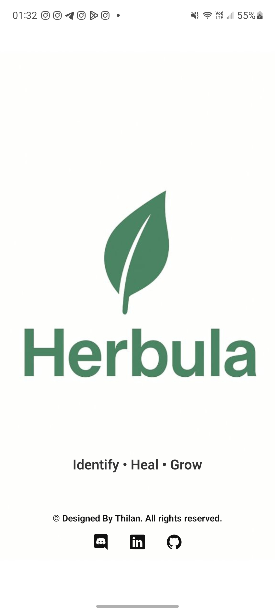
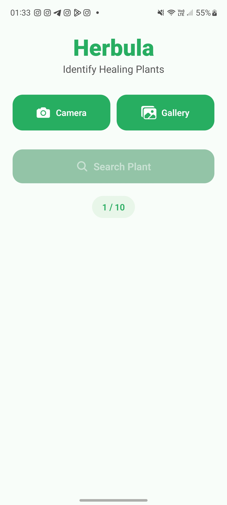
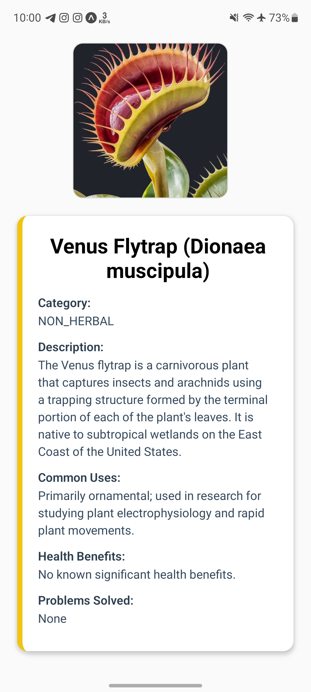
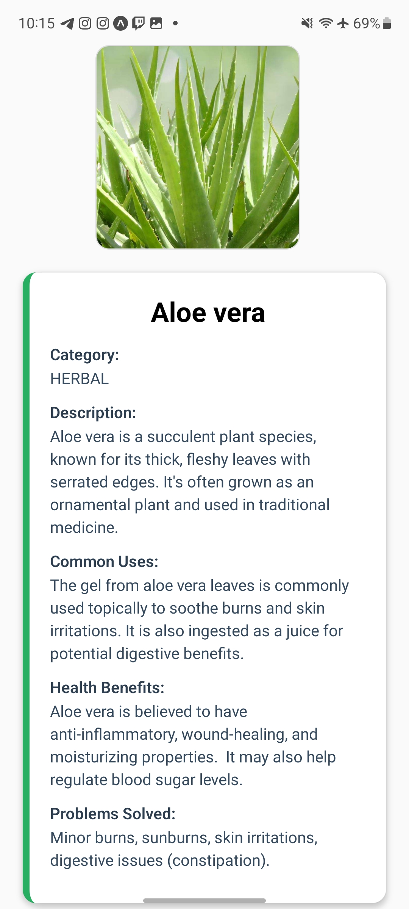
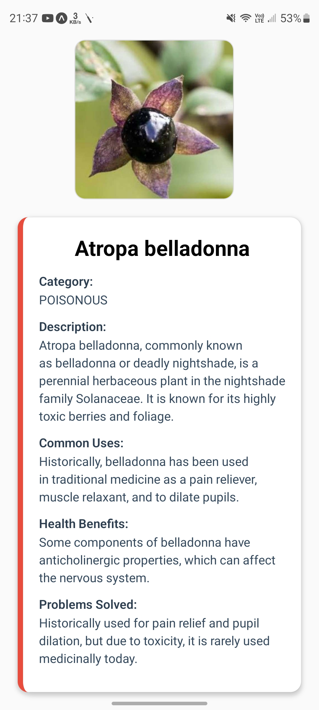

# AI-herbal-plants-identifier--JavaEE-Node.js-React-Native-
Herble Plants Identifier is a cutting-edge, cross-platform mobile application that leverages artificial intelligence to help users identify, explore, and learn about herbal plants. Whether you take a photo of a plant or select one from your gallery

# Herbula 🌿

**🚫 Proprietary Project – All Rights Reserved**

This project, **Herbula**, including all code, assets, and documentation, is the exclusive property of **Thilan Kalhara**.  

For permissions or inquiries, contact: **thilanKalhara8@gmail.com**

---

## About

Herbula is a **cross-platform mobile app** that identifies **healing plants** using AI. Users can either take a photo or select images from their gallery, and the app returns:

- Plant name (common/scientific)
- Short description
- Traditional or modern uses
- Known medicinal benefits
- Health problems it may help with
- Category: herbal, poisonous, or non-herbal

---

## Tech Stack

**Front-end (Mobile App)**

- React Native + Expo
- Image upload and manipulation using `expo-image-picker` & `expo-image-manipulator`
- AsyncStorage for daily usage limits
- Navigation with `@react-navigation/native` and native stack

**Back-end**

- Java Servlet (Tomcat)
- Gemini API for AI plant identification
- JSON communication for sending images and receiving plant data
- Optional proxy support for API requests

---

## Features

- Camera or gallery image upload
- Limit of 10 searches per day
- Image preview with remove option
- AI-generated plant suggestions
- Clean, user-friendly interface

---

## Screenshots

### 🟦 Splash Screen
<p align="center">
  
</p>

### 🟩 Home Screen
<p align="center">
  
</p>

### 🟧 Result Screen (1)
<p align="center">
  
</p>

### 🟪 Result Screen (2)
<p align="center">
  
</p>

### 🟥 Result Screen (3)
<p align="center">
  
</p>


---


## Authors

[@Thilankalhara](https://github.com/Thilankalhara)

## License

See the [LICENSE](./LICENSE) file for full copyright and usage terms.


## Installation

1. Clone the repository
   ```bash
   git clone <repo-url>
   cd Herbula
   
   replace with your ip in (.env) and genimi api key too (backend/GenerateSuggestions.java)

   npm install

Run:
npx expo start
